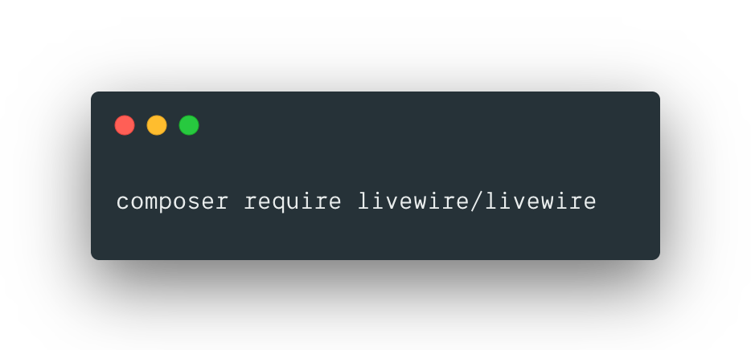

# Awesome Livewire 

> A full-stack framework for Laravel that takes the pain out of building dynamic UIs.

A curated list of [Livewire](https://github.com/livewire/livewire) resources.

<!-- TOC -->

* [Official Resources](#official-resources)
* [Articles](#articles)
* [Podcasts](#podcasts)
* [Videos & Screencasts](#videos--screencasts)
* [Examples](#examples)
* [Plugins](#plugins)
* [Tooling](#tooling)
* [Other](#other)

<!-- /TOC -->

To contribute, fork this repository, add your new resource and submit a PR. For more information, see [CONTRIBUTING](/CONTRIBUTING.md).

## Official Resources

* [Livewire Website](https://laravel-livewire.com/)
* [Livewire Forum](https://forum.laravel-livewire.com/)
* [Livewire GitHub](https://github.com/livewire/livewire)
* [Livewire Twitter](https://twitter.com/LaravelLivewire)

## Articles

* [Replacing web sockets with Livewire](https://freek.dev/1622-replacing-web-sockets-with-livewire) (Freek Van der Herten)
* [Inertia.js and Livewire: a high level comparison](https://sebastiandedeyne.com/inertia-js-and-livewire-a-high-level-comparison/) (Sebastian De Deyne)
* [Building complex forms with Laravel Livewire in Oh Dear](https://freek.dev/1609-building-complex-forms-with-laravel-livewire-in-oh-dear) (Freek Van der Herten)
* [Building a realtime dashboard powered by Laravel, Livewire and Tailwind](https://freek.dev/1645-building-a-realtime-dashboard-powered-by-laravel-livewire-and-tailwind-2020-edition) (Freek Van der Herten)

## Podcasts

* [Official Livewire Podcast](https://laravel-livewire.com/podcast)
* [Launching Livewire at Laracon](https://noplanstomerge.simplecast.com/episodes/launching-livewire-at-laracon) (No Plans to Merge)
* [We Brainstorm Insanely Cool Livewire Things](https://noplanstomerge.simplecast.com/episodes/we-brainstorm-insanely-cool-livewire-things) (No Plans to Merge)

## Videos & Screencasts

* [Official Livewire Screencasts](https://laravel-livewire.com/screencasts/installation)
* [Introducing: Livewire](https://www.youtube.com/watch?v=fX1aOWWt2nQ) (Laracon 2019)
* [Building Data-Tables with Livewire](https://laracasts.com/series/guest-spotlight/episodes/3) (Laracasts)
* [Headless Livewire](https://laracasts.com/series/guest-spotlight/episodes/10) (Laracasts)
* [Getting started with Laravel Livewire](https://codecourse.com/courses/getting-started-with-laravel-livewire) (CodeCourse)
* [Livewire for Laravel](https://www.youtube.com/watch?v=fhKcI3HAP98) (Andre Madarang)
* [Should I, as a Laravel Developer, learn Vue or Livewire?](https://www.youtube.com/watch?v=3XS4G0IHN4U) (Matt Stauffer)
* [How to build a contact form with Laravel Livewire](https://www.youtube.com/watch?v=Qljh8w5YX44) (Stefen Bauer)
* [Real-time Livewire w/ Laravel Echo & Pusher](https://calebporzio.com/video-realtime-livewire-w-laravel-echo-pusher) (Caleb Porzio)
* [Live-Updating Status Page with Livewire](https://calebporzio.com/live-updating-status-page-with-livewire) (Caleb Porzio)

## Examples

* [Nova Packages](https://github.com/tightenco/novapackages) (full app)
* [Dependant Select](https://github.com/asantibanez/livewire-dependant-select-demo)
* [To-do List](https://github.com/aleksandertabor/todo)

## Packages / Plugins

* [Livewire Sortable](https://github.com/livewire/sortable)
* [Livewire Calendar](https://github.com/asantibanez/livewire-calendar)
* [Livewire Resource Time Grid](https://github.com/asantibanez/livewire-resource-time-grid)
* [Livewire Status Board](https://github.com/asantibanez/livewire-status-board)
* [Livewire Select](https://github.com/asantibanez/livewire-select)
* [Livewire Dynamic Tables](https://github.com/rappasoft/laravel-livewire-tables)
* [Livewire Portals](https://github.com/jeffochoa/livewire-portals)

## Tooling

* [Livewire Goto](https://marketplace.visualstudio.com/items?itemName=lakuapik.livewire-goto) (VSCode Extension)
* [Livewire Docs](https://marketplace.visualstudio.com/items?itemName=austenc.livewire-docs) (VSCode Extension)
* [Alfred Livewire Docs](https://github.com/AlexMartinFR/alfred-livewire-docs) (Alfred Workflow)
* [Laravel Debug Bar](https://github.com/barryvdh/laravel-debugbar) (supports Livewire)
* [Pest Higher-Order Livewire Testing](https://pestphp.com/docs/plugins/livewire/)

## Other

* [Livewire Discord Server](https://discord.gg/CguyuRp)
* [TALL Preset (TailwindCSS, AlpineJS, Laravel and Livewire)](https://github.com/laravel-frontend-presets/tall/)
